# 黄牛日志分析解题报告

本次比赛中，对“黄牛挂号日志分析”这道赛题的解答思路主要从三个方向出发，以下将一一介绍，并给出我们最终结果的得到方式：

## 1. 基于规则的检测

出发点：由于数据中提供了['ID', '省份', 'APPID', 'IP_ADDRESS', '订单创建时间', '患者ID', '患者创建时间', '就诊日期', '就诊科室名称', '医生姓名', '状态', '商户订单号']等丰富的字段，以及医院挂号的相关规则，所以认为可以根据黄牛的行为规律设计一些规则将黄牛从中过滤出来

该部分设计较多的数据分析技术，具体如下:

1. 对于同一个用户/IP的多次"不同操作"，分析其中的过大偏离

    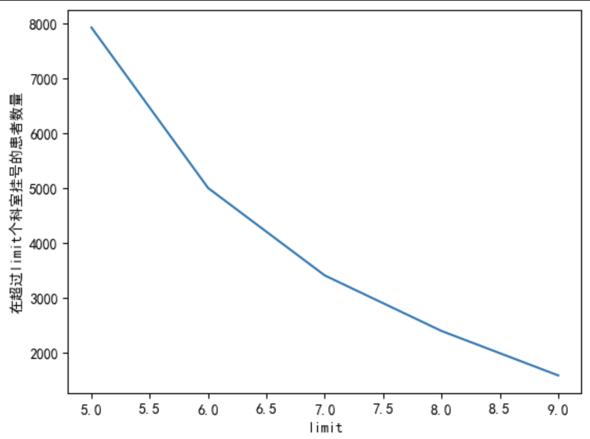

    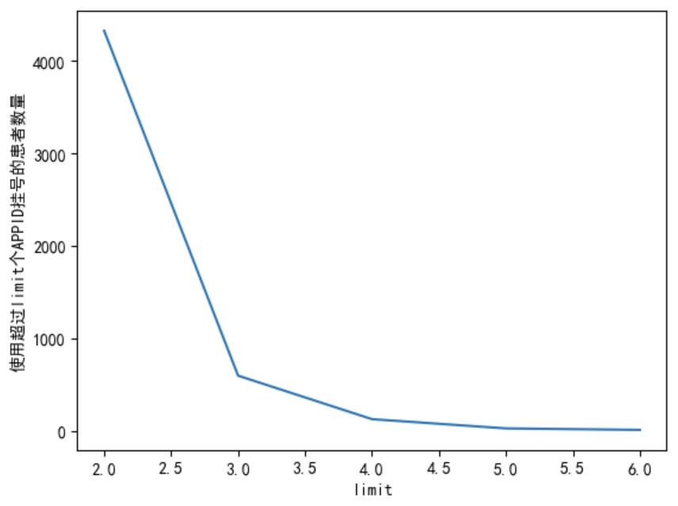

    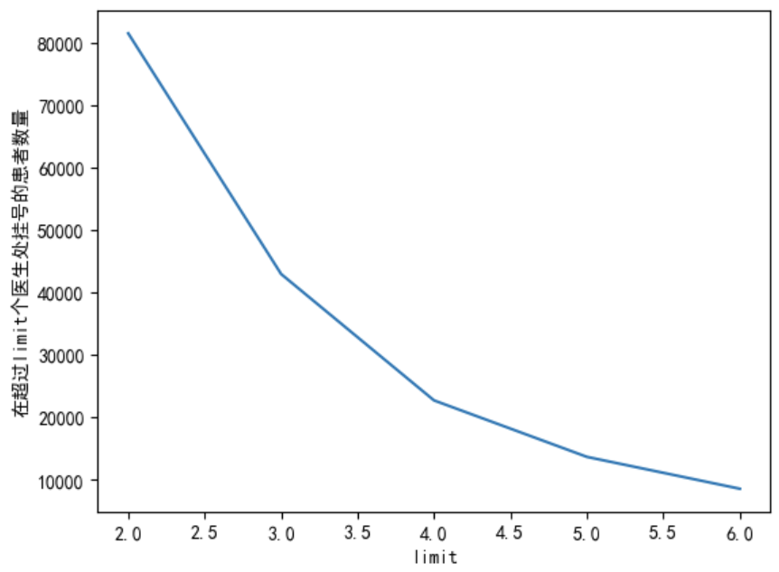

    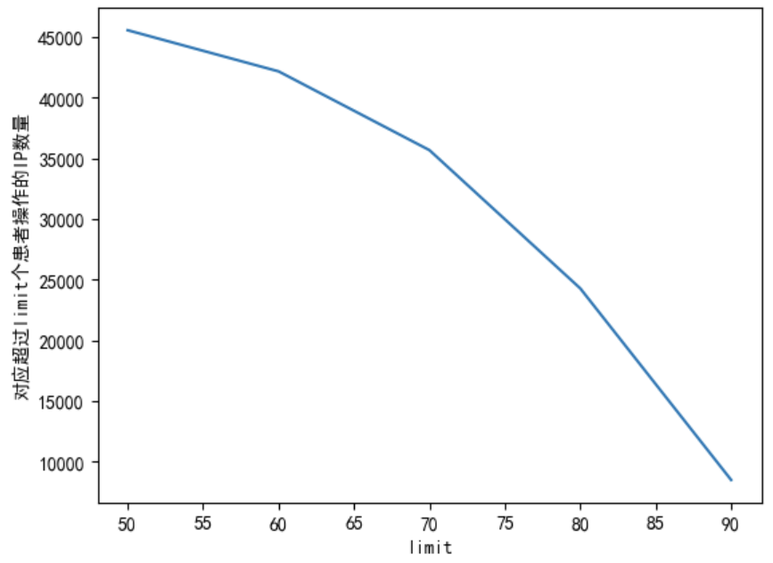

2. 时间上的统计量

    可以发现16点的操作异常多

    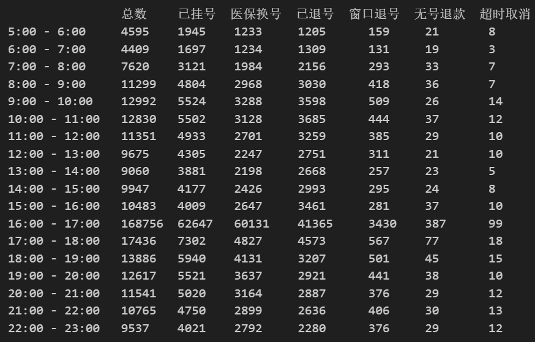

    两个异常峰值"抢票"时段——5,16点

    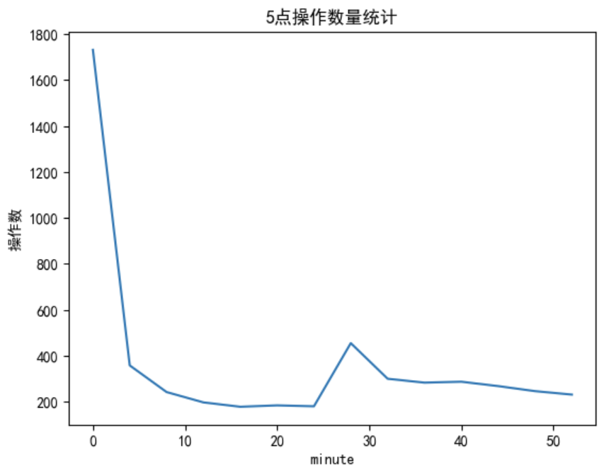

    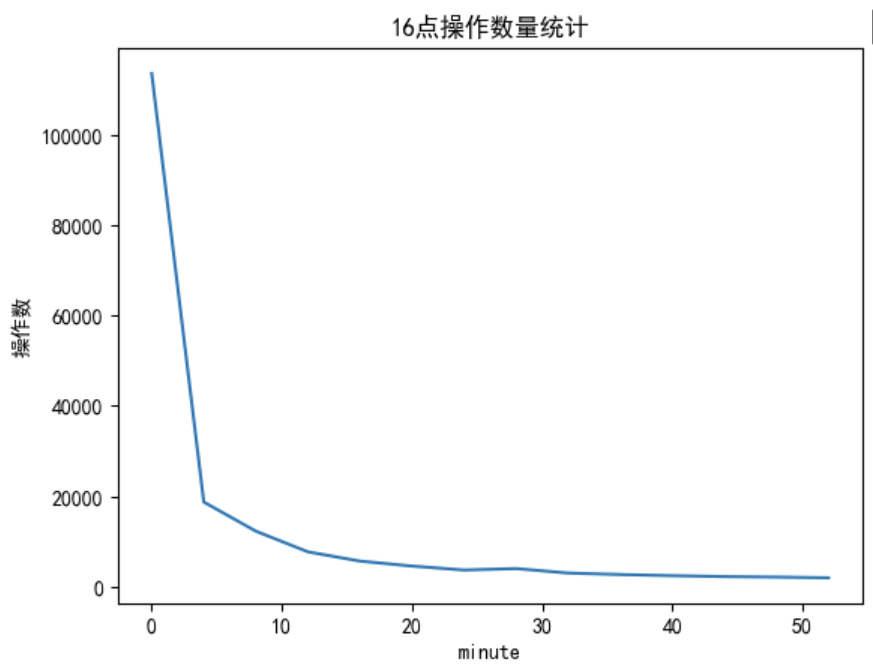

    正常时段

    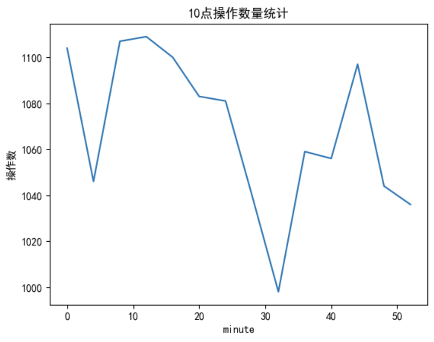

基于上述分析的结果中明显偏离的少量数据，设计了大量规则

而比赛中具体使用的规则，设计和放弃的原因(除了数据分析之外)如下：

|序号|规则|设计原因|是否使用及放弃原因|
|---|---|---|---|
|1|IP相同，用户数超过limit，且属地不在北京/河北|相同IP发送大量请求，推断可能存在黄牛平台与个体用户交易后，集中向医院平台发送大量请求。而且考虑到NAT的存在，可能将同一局域网下的大量用户映射到相同IP，所以这里排除了属地是北京和河北的IP(距离医院较近，可能存在这样集中挂号的公共空间)|否，有可能正常用户的挂号请求本来就是正规的APP平台通过服务器统一发送的，所以大量相同IP不能说明问题|
|2|同一个用户操作超过limit次|认为40天的时间内，一个用户不会生很多次病|否，考虑到复诊等原因，同一个用户可能反复挂号来到医院|
|3|同一个用户在超过limit个医生处挂号|如果是复诊的话一般不会更换治疗医生|否，实际生活中可能存在在多个医生处看病以相互比较的情况|
|4|用户相同，在超过6个科室挂号|同一个用户可能因为复诊等原因多次来医院，也可能在不同医生处就诊，但是同一种病不会换科室|是|
|5|同一个用户使用超过limit个APPID进行挂号|正常用户y一般不会更换挂号APP|是|
|6|抢号过快，即在5:00:00-5:00:01, 16:00:00-16:00:01之间操作成功的用户|黄牛可能通过网络工具使得可以极快的抢到才释放出的号源|存疑，正常用户也有快速抢票的能力|
|7|低频地区，即40天内一共操作小于40次的地区|查看表格后发现了大量外国地区的挂号记录，怀疑是黄牛通过技术手段对IP进行了伪装以避免被流量监测|存疑，发现有看似正常的用户也有IP来自外国的时候|
|8|大量退号|黄牛惯用手段，即抢到号之后与其它用户交易，再退号放出名额让交易对象得到想要的号源，正常用户不会退号过多次|否，正常挂号和退号的比例不容易划分，正常用户也存在操作错误/实际就诊后发现诊室与病症不对应而退号的情况|

此外，查看各个规则的筛选时，还发现了一些明显是黄牛的用户(全是退号，且科室几乎各不相同)，于是将其单独列出，并加入result

## 2. 基于聚类的检测

出发点；基于“黄牛的行为有一定的共性”这条假设，认为可以通过获取黄牛的相关特征，映射到向量空间，然后通过聚类的方式将黄牛与正常用户区分开来

难点：但是实际尝试之后发现，黄牛的特征中，既包括那些有聚合特征体现的(操作次数多且科室/APPID不同)，也有通过奇异值来体现的(低频地区)。简单地对各个维度做聚类可能并不能很好地得到黄牛的分类，何况黄牛的操作模式可能不止一种，所以最终并没有采取这种查找方式

以下是采用了不同的聚类数得到的多个类别的数量，可以发现各类中分布相对平均，极少的黄牛并没有表现出明显的分布集中

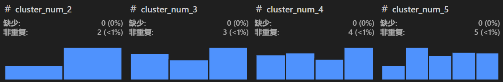

## 3. 基于学习的检测

出发点：黄牛是有规律的，但是不能通过简单的聚类方式来划分，所以考虑使用基于机器学习的方法进行筛查

具体思路：使用已有模型LogBERT/手动编写定制化神经网络

1. 使用已有模型LogBERT

    LogBERT是在谷歌BERT模型基础上开发，用于检测文本日志的开源框架。
    
    LogBERT首先处理原始的日志文本数据，得到日志序列和用于预训练的数据集。
    
        第一步用日志解析器Drain处理原始文本日志，用树结构从中提取所有的事件类型并将其数字化。
        
        第二步构建日志序列时会根据数据集自身的特性选择不同的标准。在开源的HDFS日志数据集上测试时，
        按日志事件对象将日志划分为日志序列，一个序列记录一个对象上发生的所有日志事件。

        第三步根据HDFS数据集的异常标识辨别并取出部分正常的日志序列构成接下来BERT训练使用的数据集。
    
    接下来调用BERT模型进行日志检测。首先生成词汇表并用构建的训练数据集对模型预训练，最后对待测的数据进行预测。

    在本题中，我们试图用状态区分日志事件类型，用患者ID划分日志序列。
    我们通过规则匹配中得到了一部分可以认为是正常日志序列作为训练用数据集。
    但是由于事件类型区分度低，日志序列特征不足和训练数据集不够精准等原因，测试结果较差。

    训练结果较为成功

    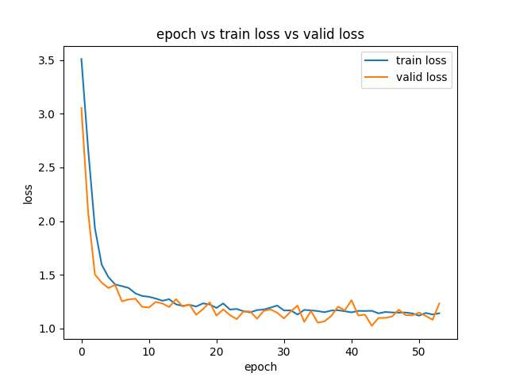

    预测结果差距较大

    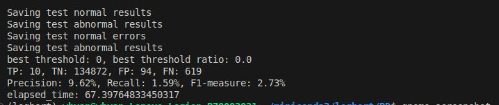

    考虑到一来本文的日志数据是xlsx表格形式，日志事件格式统一，难以从中提取有明显特征的事件格式；
    二来目前的LogBERT框架只支持检测异常率，无法提取出异常日志的ID。
    故认为LogBERT在本题实际使用时效果较差，最后我们放弃使用这个模型。

2. 手动编写定制化神经网络

    受到LogBERT启发，考虑可以自行设计一个神经网络，按用户分组得到操作序列，让后提取操作序列中的特征(序列长度不同通过填充和截断对齐)，然后通过性能强大的Transfomer模型接全连接层进行二分类。训练集和测试集就来自基于规则的测试中得分较高的数据的推导。

    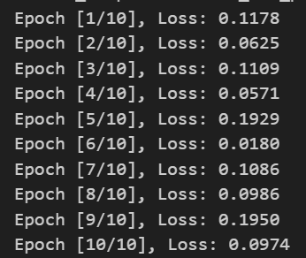

    

    如图，虽然训练后在测试集上达到了超过90%的正确率，但是在服务器测评中并没有达到预期中的结果，即没有超过基于规则的测试得分。分析后认为是训练集和特征提取的设计问题，由于训练集本身并不是完全正确(75%)而且是基于之前的规则筛选出的，特征提取时为了避免给模型添加过大的计算量，也只选择了数据的四个字段(省份，科室，医生名，状态)，这导致了训练集和模型都带有强预设——只能学到之前的基于规则的相关知识而缺乏探索能力。

具体的代码存放在log_detect.ipynb中，而每次测试结果的来源保存在"测试记录.md"中的记录当中
