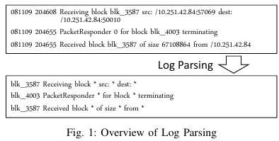
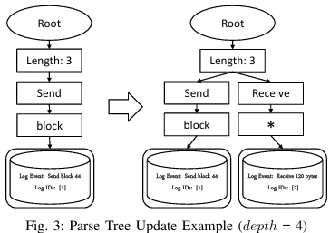

# logbert 使用
logert结构
```bash
whyan@whyan-Lenovo-Legion-R70002021:~/miniconda3$ tree logbert
logbert
├── Pipfile
├── README.md
├── scripts         下载数据集的脚本，有的网站不可用了
├── environment     环境配置文档
├── bert_pytorch    logbert源程序库，BERT模型
├── logdeep         logdeep日志解析程序库
├── loglizer        提供其他日志异常场监测程序，评估用
├── logparser       日志聚类解析程序，data_process.py中parser函数调用。只用了drain
├── output          运行时动态生成，存储中间结果等
├── HDFS            HDFS数据集上实现程序文件夹
├── BGL             BGL数据集上实现程序文件夹
└── TBird           ThunderBird数据集上实现文件夹
```
## data_process.py 原始数据处理程序
### logparser：drain


程序使用drain，另外提供了spell的代码

Drain是一种基于固定深度树的在线日志解析

流程：
1. 正则匹配提取日志内容tokens
2. 从解析树的根节点开始，根据token的数量区分日志数据组，到达第一层日志节点
3. 根据日志解析数据起始位置的token选择下一个内部节点
4. token相似度搜索，将新加入的日志token与已有日志组的token相比较，最大相似度超过阈值则认为属于该日志组，否则创建新的日志组
5. 更新解析树


参考链接：https://blog.csdn.net/qq_39378221/article/details/121212682?fromshare=blogdetail&sharetype=blogdetail&sharerId=121212682&sharerefer=PC&sharesource=2301_76811694&sharefrom=from_link

__调用：__

1. 实例化一个Logarsers类，规定 日志形式，数据集路径，输出路径，解析树深度，相似度阈值，maxchild，正则匹配表达式，keep_para。其中相似度阈值 'st' 和树的深度 'deep' 是主要需要调整的。
2. 调用类函数parser(log_file)，对数据集路径下的日志文件进行parse

在logbert/HDFS/data_process.py logbert/BGL/data_process.py中可以看到调用实例

Drain 实现（以HDFS为例）：

1. 借助日志格式参数将log文本文件转为易处理的dataframe，
2. 从日志的'<//content>'列中进行正则匹配提取EventTemplate（内容中的不变文本）作为tokens用来做树匹配搜索
3. 对每种EventTemplate计算哈希值作为EventId，作为后面查找EventTemplates的索引，存储到中间结果文件中

__为后面提供支持的中间结果文件output/hdfs/HDFS.log_templates.csv：存储每类事件的"EventId" "EventTemplate" "Occurrences"
即事件模板哈希值作为事件ID，正则匹配提取出的事件模板，事件发生次数），__

由log生成的dataframe添加'EventId''EventTemplate'和"ParameterList"（可选）列后，存到/output/hdfs/HDFS.log_structured.csv文件中。

concerns：
1. Drain似乎还不支持处理xlsx格式的日志，默认日志格式是文本形式。使用时需要调整
2. 怀疑logbert是否能支持处理中文
3. 运行BGL的 'logbert.py train' 时报错GPU内存不足，已知BGL在日志总数和大小上远小于HDFS，怀疑可能与BGL的log key数目过多或序列划分方式（滑动窗口）有关

### sampling：日志序列构建和处理
paper称对HDFS按照session id进行日志序列的划分用mapping()和hdfs_sampling()函数实现，实际上按block_id对数据分组，

在mapping函数中借助上一步的结果HDFS.log_templates.csv将EventId映射到连续的自然数序列1,2,3,...，发生次数越多的排序越靠前，存到hdfs_log_templates.json文件中； 

然后hdfs_sampling用mapping生成的文件和原始日志生成日志计数向量，记录每个block中发生的所有日志事件组成序列存到hdfs_sequence.csv文件中。

__这一步中间结果：hdfs_sequence.csv每个对象（block_id）和该对象上发生的事件的序列__

在BGL和TBird中，按滑动窗口构建。
### 构建训练数据集
HDFS需要读取anamoly_label文件，BGL需要读取日志文件中的label。分别取出其中正常的日志数据构建用于训练的数据集

## logbert.py 
logbert上的实现。options字典存储一系列BERT模型需要的参数包括输出的各个路径；序列划分大小；掩码率；样本率；
在HDFS 和 BGL中，除输出路径外不一样的选项只有
```python
options["mask_ratio"] = 
# sample ratio
.......
# predict
options["num_candidates"] = 
```
实现时三遍调用，
1. vocab：调用bert_pytorch/dataset/vacab.py中定义的类构建词汇表，并存储到output/{该数据集}/文件夹下
2. train：创造 bert_pytorch/train_log.py的Train 实例，调用train训练模型
3. preditct：调用 bert_Pytorch/predict.log的Predictor 实例，调用predict预测让模型做日志检测

## hdfs数据集上实例
### 输入输出文件夹
根据logbert设定，需数据集平放在～/.dataset/hdfs文件夹下
HDFS_v1数据集
```bash
hdfs
├── anomaly_label.csv 异常数据标注
├── Event_occurrence_matrix.csv 事件发生矩阵
├── Event_traces.csv
├── HDFS.log   数据集
├── HDFS.log_templates.csv
├── HDFS.npz
└── README.md
```
输出文件夹：logbert/output/hdfs
```bash
output/hdfs
├── bert                            logbert.py 运行时中间结果文件夹
│   ├── best_bert.pth
│   ├── best_center.pt
│   ├── best_total_dist.pt
│   ├── parameters.txt
│   ├── test_abnormal_errors.pkl
│   ├── test_abnormal_results
│   ├── test_normal_errors.pkl
│   ├── test_normal_results
│   ├── train_log2.csv
│   ├── train_valid_loss.png
│   └── valid_log2.csv
├── deeplog                         deeplog.py 运行时中间结果文件夹
├── HDFS.log_structured.csv         结构化的日志数据集，
├── HDFS.log_templates.csv          drain parser输出结果
├── hdfs_log_templates.json         按序列划分窗口时的中间文件
├── hdfs_sequence.csv               处理好的日志事件序列
├── loganomaly                      loganomaly.py 运行时中间结果文件夹
├── test_abnormal                   生成训练数据集时的副产物
├── test_normal
├── train                           数据处理生成的训练用数据集
└── vocab.pkl
```
### 相关文件内容格式示例
```
log_format = '<Date> <Time> <Pid> <Level> <Component>: <Content>'
原始的HDFS.log
081109 203518 143 INFO dfs.DataNode$DataXceiver: Receiving block blk_-1608999687919862906 src: /10.250.19.102:54106 dest: /10.250.19.102:50010
081109 203518 35 INFO dfs.FSNamesystem: BLOCK* NameSystem.allocateBlock: /mnt/hadoop/mapred/system/job_200811092030_0001/job.jar. blk_-1608999687919862906
081109 203519 143 INFO dfs.DataNode$DataXceiver: Receiving block blk_-1608999687919862906 src: /10.250.10.6:40524 dest: /10.250.10.6:50010

Drain parer 生成的中间数据HDFS.log_templates.csv，并在mapping建立日志序列时被排序
EventId,EventTemplate,Occurrences
9b7aa7a3,Receiving block blk_<*> src: <*> dest: /<*>:50010,1723232
81358cb3,BLOCK* NameSystem.allocateBlock: <*> blk_<*>,575061

Drain parser 生成的中间数据HDFS.log_structured.csv，将原始log文件csv化，后面没用到
LineId,Date,Time,Pid,Level,Component,Content,EventId,EventTemplate
1,081109,203518,143,INFO,dfs.DataNode$DataXceiver,Receiving block blk_-1608999687919862906 src: /10.250.19.102:54106 dest: /10.250.19.102:50010,9b7aa7a3,Receiving block blk_<*> src: <*> dest: /<*>:50010
2,081109,203518,35,INFO,dfs.FSNamesystem,BLOCK* NameSystem.allocateBlock: /mnt/hadoop/mapred/system/job_200811092030_0001/job.jar. blk_-1608999687919862906,81358cb3,BLOCK* NameSystem.allocateBlock: <*> blk_<*>

创建序列过程中mapping生成的HDFS.log_templates.json
{"9b7aa7a3": 1, "2f313c72": 2, "2e1cf0aa": 3, "797b9c47": 4, "b0023896": 5, "bb837bbd": 6, "81358cb3": 7, "6caae5bd": 8, "be6f070c": 9, "d23206c6": 10, "fa05ffa7": 11, "53c00e5f": 12, "d7507d1e": 13, "0d168c98": 14, "cf9b33dc": 15, "d6115493": 16, "46f6e99a": 17, "b46e298a": 18, "fac2c191": 19, "4ed2a0c0": 20, "5e47c5c3": 21, "1995da3b": 22, "1d48c538": 23, "b3ef6470": 24, "ceedf750": 25, "caed8b80": 26, "6f83a284": 27, "5832ad42": 28, "c859931b": 29, "5ac8245b": 30, "190eb501": 31, "f8ba9329": 32, "47b367ea": 33, "1ff93be5": 34, "72988c9b": 35, "78ad37b3": 36, "ffa3fe68": 37, "60600882": 38, "b55f27b2": 39, "9111794a": 40, "ebe1d2fb": 41, "a26fadbc": 42, "f52097f4": 43, "0d527039": 44, "17ee882d": 45, "fb314c6d": 46, "0555f7e9": 47}

生成的日志序列文件hdfs_sequence.csv
BlockId,EventSequence
blk_-1608999687919862906,"[1, 7, 1, 1, 3, 3, 4, 4, 3, 4, 2, 2, 2, 11, 1, 12, 11, 1, 21, 20, 2, 2, 8, 20, 11, 11, 1, 1, 12, 21, 2, 2, 1, 11, 1, 12, 8, 8, 8, 8, 8, 8, 8, 8, 8, 8, 21, 20, 11, 8, 8, 8, 8, 8, 8, 8, 8, 8, 8, 8, 8, 8, 8, 8, 2, 2, 8, 8, 8, 8, 8, 8, 8, 8, 8, 8, 8, 8, 8, 8, 8, 8, 8, 8, 8, 8, 8, 8, 8, 8, 8, 8, 8, 8, 8, 8, 8, 8, 8, 8, 8, 8, 8, 8, 8, 8, 8, 8, 8, 8, 8, 13, 8, 8, 8, 8, 8, 8, 8, 8, 8, 8, 8, 8, 8, 8, 8, 8, 8, 8, 8, 8, 8, 8, 8, 8, 8, 8, 8, 8, 8, 8, 8, 8, 8, 8, 8, 8, 8, 14, 11, 1, 8, 8, 8, 8, 8, 12, 8, 8, 8, 8, 2, 8, 8, 8, 8, 8, 8, 8, 8, 8, 8, 8, 8, 8, 8, 8, 8, 8, 8, 8, 8, 8, 8, 8, 8, 8, 8, 8, 8, 8, 8, 8, 8, 8, 8, 8, 8, 8, 8, 8, 8, 8, 8, 8, 8, 8, 8, 8, 8, 8, 8, 8, 8, 8, 8, 8, 8, 8, 8, 8, 8, 8, 8, 8, 8, 8, 8, 8, 8, 8, 8, 8, 8, 8, 8, 8, 8, 8, 8, 8, 8, 8, 8, 8, 8, 8, 8, 6, 6, 6, 6, 6, 6, 6, 6, 6, 6, 5, 5, 5, 5, 5, 5, 5, 5, 5, 5]"
blk_7503483334202473044,"[1, 1, 7, 1, 3, 4, 3, 4, 3, 4, 2, 2, 2, 8, 10, 10, 6, 6, 6, 5, 5, 5]"

生成的训练用数据集train
1 1 1 7 3 4 3 4 3 4 2 2 2 6 6 6 5 5 5
1 1 1 7 3 4 3 4 3 4 2 2 2 6 6 6 5 5 5
1 1 7 1 3 4 3 4 3 4 2 2 2 10 6 6 6 5 5 5
7 1 1 1 2 2 2 3 4 3 4 3 4 9 8 9 8 9 8 6 6 6 5 5 5
1 7 1 1 3 4 4 3 4 2 2 2 3 6 6 6 5 5 5
1 7 1 1 3 4 3 4 2 2 3 4 2 9 9 8 10 6 6 6 5 5 5
```