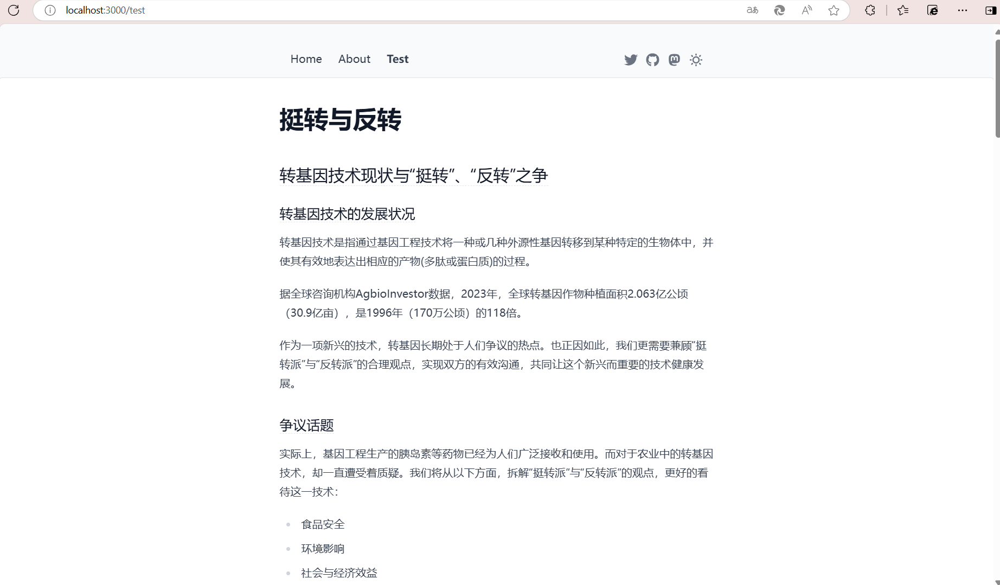

# 网站操作手册

## 介绍

### 技术栈

- 后端：`nginx`
- 前端：`Nuxt`

### 网站架构

目前只有主站 [datacon-14351](https://datacon.xyz)

## 前端编辑

### 模板

采用了 `Nuxt` 模板 `content-wind`

> 项目地址：[github/content-wind](https://github.com/Atinux/content-wind)

### 目录结构

```bash
./
|-- README.md
|-- app.config.ts		# 应用配置
|-- components			# 组件模板
|-- content				# 存放markdown文件作为文章
|-- node_modules
|-- nuxt.config.ts
|-- package-lock.json
|-- package.json
|-- public				# 图标与封面资源
`-- tsconfig.json
```

主要编辑操作是在 `content/`文件夹下添加 `markdown` 文件

### 文章撰写

在本 Web 应用中，文章主要由以下三个部分组成：

- 文章头：配置 SEO 信息：

  ```markdown
  ---
  navigation:
    title: Test
  layout: full-width
  head:
    description: 介绍了转基因技术中的“挺转”与“反转”
  ---
  ```

- 文章内容：正常的 `markdown` 内容

- 组件：重用 `components/conponent/` 下的 `.vue` 组件

  具体操作如仓库中介绍：

  > **Vue Components**
  >
  > Add Vue components into the `components/content/` directory and start using them in Markdown.
  >
  > See the `<MarkdownBlock>` component in [`components/content/MarkdownBlock.vue`](https://github.com/Atinux/content-wind/blob/main/.demo/components/content/MarkdownBlock.vue).
  >
  > By leveraging the [`<ContentSlot>`](https://content.nuxt.com/components/content-slot) component from Nuxt Content, you can use both slots and props in Markdown thanks to the [MDC syntax](https://content.nuxt.com/usage/markdown).

只需按照上述内容完成文章，放入 `content/` 文件夹，就会自动创建导航与页面：

