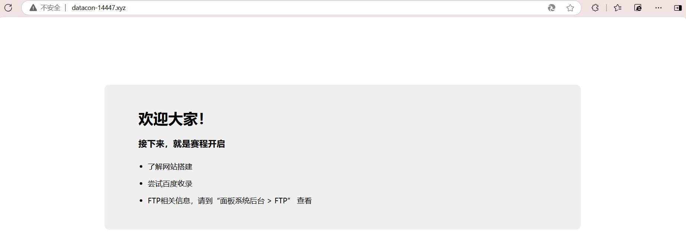

- 目前查询到已注册域名：

- [13574](http://datacon-13574.xyz)
  - [13574](http://datacon-13574.xyz)

- [13590](http://datacon-13590.xyz)
  - [13590](http://datacon-13590.xyz)

- [13644](http://datacon-13644.xyz)：未备案
  - [13644](http://datacon-13644.xyz)：未备案

- [13648](http://datacon-13648.xyz)：未备案
  - [13648](http://datacon-13648.xyz)：未备案

  - Ubuntu nginx 18.0（**过期nginx**）
  
- [13667](http://datacon-13667.xyz)
    - Ubuntu nginx 18.0（**过期nginx**）

  - [13667](http://datacon-13667.xyz)

- [13673](http://datacon-13673.xyz)
  - [13673](http://datacon-13673.xyz)

- [13684](http://datacon-13684.xyz)
  - [13684](http://datacon-13684.xyz)

- [13721](http://datacon-13721.xyz)：已建站
  - [13721](http://datacon-13721.xyz)：已建站

  - /#wp-config.php#: #wp-config.php# file found. This file contains the credentials.
  - 成都电子科技大学
    - /#wp-config.php#: #wp-config.php# file found. This file contains the credentials.
    - 成都电子科技大学

- [13765](http://datacon-13765.xyz)
  - [13765](http://datacon-13765.xyz)

  - nginx
  
- [14098](http://datacon-14098.xyz)

- [14127](http://datacon-14127.xyz)

- [14147](http://datacon-14147.xyz)

- [14162](http://datacon-14162.xyz)

- [14165](http://datacon-14165.xyz)：已建站

- [14184](http://datacon-14184.xyz)：已建站

- [14232](http://datacon-14232.xyz)

- [14243](http://datacon-14243.xyz)

- [14259](http://datacon-14259.xyz)

- [14289](http://datacon-14289.xyz)：已建站

- [14311](http://datacon-14311.xyz)

- [14404](datacon-14404.xyz)

- [14447](http://datacon-14447.xyz)：疑似主办方测试网站：

  

  - [14456](http://datacon-14456.xyz)

  - [14476](http://datacon-14476.xyz)

  - [14579](http://datacon-14579.xyz)
- [14476](http://datacon-14476.xyz)

  - [14682](http://datacon-14682.xyz)
- [14579](http://datacon-14579.xyz)

- [14682](http://datacon-14682.xyz)
