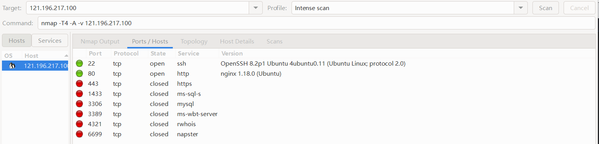
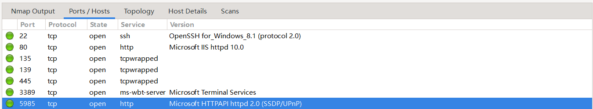

目前查询到已注册域名：

- datacon-13574.xyz

- datacon-13590.xyz

- datacon-13644.xyz

- [杭州某ip](http://datacon-13648.xyz)

  - Ubuntu nginx 18.0（**过期nginx**）
  - /#wp-config.php#: #wp-config.php# file found. This file contains the credentials.
  - The X-Content-Type-Options header is not set. This could allow the user agent to render the content of the site in a different fashion to the MIME type. See: https://www.netsparker.com/web-vulnerability-scanner/vulnerabilities/missing-content-type-header/
  - The anti-clickjacking X-Frame-Options header is not present. See: https://developer.mozilla.org/en-US/docs/Web/HTTP/Headers/X-Frame-Options
  - 

- 13667

- datacon-13673.xyz

- datacon-13684.xyz

- [成电已建站](http://datacon-13721.xyz)

  - /#wp-config.php#: #wp-config.php# file found. This file contains the credentials.

- [杭州or上海ip](http://datacon-13765.xyz)

  - The X-Content-Type-Options header is not set. This could allow the user agent to render the content of the site in a different fashion to the MIME type. See: https://www.netsparker.com/web-vulnerability-scanner/vulnerabilities/missing-content-type-header/
  - The anti-clickjacking X-Frame-Options header is not present. See: https://developer.mozilla.org/en-US/docs/Web/HTTP/Headers/X-Frame-Options
  - nginx
  - /#wp-config.php#: #wp-config.php# file found. This file contains the credentials.

- datacon-14098.xyz

- datacon-14127.xyz

- 14147

- datacon-14162.xyz

- datacon-14165.xyz

- 14184

- [香港or美国ip](datacon-14232.xyz)

- [北京某ip](http://datacon-14243.xyz)

- [杭州or深圳](http://datacon-14259.xyz)

- 14289

- [复旦杜禹衡队](http://datacon-14311.xyz)

  - 端口情况：

    

  - 网站扫描：

    ip/aspnet_client/system_web
  
- datacon-14404.xyz

- [广东腾讯云](http://datacon-14447.xyz)

- [14456](http://datacon-14456.xyz)

- datacon-14476.xyz

- datacon-14579.xyz

- datacon-14682.xyz

- 