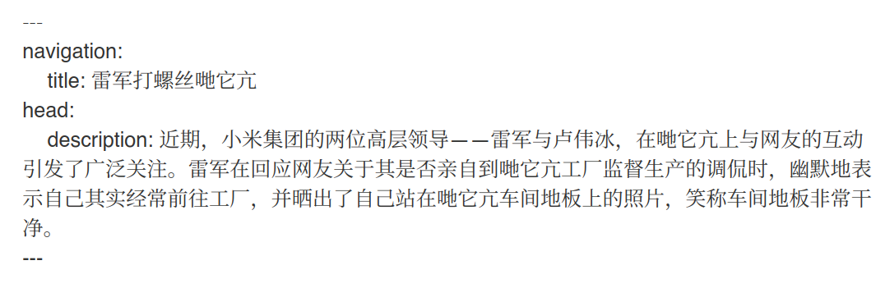
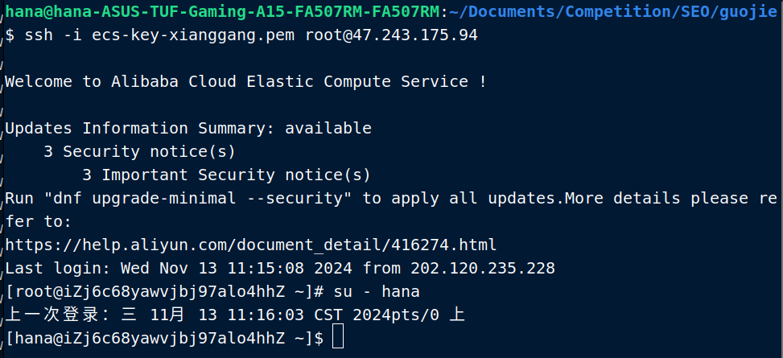
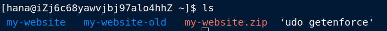
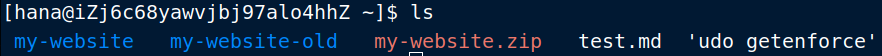

**第一步：编辑一份Marddown文件**

[Typora-Markdown编辑软件](https://typora.io/)

需要按照[参考格式](https://github.com/lsq0713/datacon-RedDragon/blob/main/SEO/website/content/1.index.md)添加一个文头



**第二步：重启服务端**

> 需要密钥时请向guojie索要

ssh登陆命令（需要在bash环境中运行）

```bash
# 远程作为root登陆服务器
ssh -i ecs-key-xianggang.pem root@47.243.175.94
su - hana # root操作危险，请务必先切换为普通用户，密码为guojie
```



```bash
cd /home/hana # 移动到工作目录下
ls # 查看目录下的文件
```



```bash
# 远程传输文件
scp -i ecs-key-xianggang.pem my-website.zip root@47.243.175.94:/home/hana
```

下图:假设你上传了一个test.md



```bash
mv test.md my-website/content/ # 移动文件位置
```

pm2服务更新命令

```bash
pm2 list
pm2 stop my-website
pm2 start .output/server/index.mjs --name my-website
```

在网站上查看你的网页


