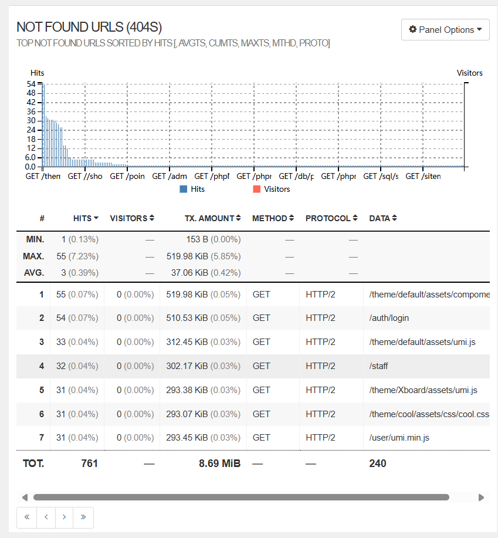
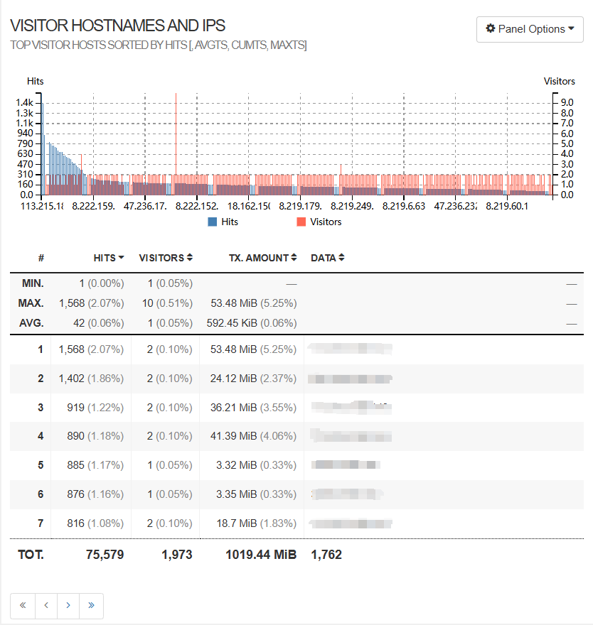

# 搜索引擎优化

[TOC]

## 赛题回顾

> Datacon 社区
>
> 搜索引擎优化（Search Engine Optimization，简称SEO）是一种通过了解搜索引擎的运作规则来提高网站在搜索引擎内排名的方法，从而增加网站的可见度和访问量。这种技术涉及网站结构、内容质量、关键词策略等多个方面。 然而，一些不法分子滥用SEO技术，发展出“黑帽SEO（Black Hat SEO）”，通过欺骗或操纵搜索引擎算法获得不正当排名优势。常见手法包括关键词堆砌、链接农场等，严重影响用户体验和互联网生态。搜索引擎公司持续更新算法以打击这些行为。 在本挑战中，参赛者将在真实的百度搜索引擎中一展身手，运用你的SEO技巧和创意，将你的网页推向搜索结果的顶峰。我们鼓励参赛者探索和应用合法、有效的SEO策略，以提高网页在搜索结果中的排名。通过这场比赛，我们希望参赛者能够深入理解SEO的原理，同时认识到合法的SEO策略对于网站长期发展的重要性。

赛题以“哋它亢”作为关键词，要求参赛选手队伍自行建立网站并进行 SEO 优化，最终成绩综合参考 百度 与 谷歌 两款搜索引擎上的网站排名给出分数。

本队伍（红龙队）在赛事中依托多种 SEO 手段，最终在搜索引擎收录中获取了前十名的成绩。

## 网站建设

### 前期准备（TODO）

- 服务器：阿里云 ECS 服务器

  > 写上服务器配置

- 域名：datacon-14351.xyz，注册商为阿里云

- 备案：中国大陆所有网站均需要进行ICP备案。ICP备案不仅是法律规定，也是提高网站可信度的一种方式，有助于提高网站的权重。

  考虑到备案审核流程和服务器租赁时间的问题，本队选取了香港服务器以跳过ICP备案审核。但在实际SEO实践中，进行ICP备案是必要的。

- SSL 证书配置：HTTPS通过SSL/TLS加密数据，保护用户信息不被窃取，增强用户对网站的信任。目前搜索引擎会优先考虑使用HTTPS的网站，有助于提升搜索排名。

  ```nginx
  server {
          listen       443 ssl http2;
          listen       [::]:443 ssl http2;
          server_name  datacon-14351.xyz www.datacon-14351.xyz;
          ssl_certificate "/etc/nginx/conf.d/datacon-14351.xyz.pem";
          ssl_certificate_key "/etc/nginx/conf.d/datacon-14351.xyz.key";
          ssl_session_cache shared:SSL:1m;
          ssl_session_timeout  10m;
          ssl_ciphers PROFILE=SYSTEM;
          ssl_prefer_server_ciphers on;
      	...
  }
  ```

### LNMP 环境（TODO）

> 版本号

- Linux
- nginx
- Mysql
- PHP

### 服务器配置

本队采用 Nginx 作为 Web 服务器，并使用 Nuxt 与 Wordpress 作为建站系统。

```nginx
server {
    listen       80;
    listen       [::]:80;
    server_name  datacon-14351.xyz;
    root  /usr/share/nginx/html/wordpress;

    include /etc/nginx/default.d/ *.conf;
    location / {
        index index.php;
    }
    location ~ .php$ {
        root /usr/share/nginx/html/wordpress;    #网站根目录
        fastcgi_pass 127.0.0.1:9000;   
        fastcgi_index index.php;
        fastcgi_param  SCRIPT_FILENAME  $document_root$fastcgi_script_name;
        include fastcgi_params;   #Nginx调用fastcgi接口处理PHP请求。
    }
    error_page 404 /404.html;
        location = /40x.html {
    }

    error_page 500 502 503 504 /50x.html;
        location = /50x.html {
    }
}

```

<center>Code-1：Wordpress 建站与相关 Nginx 配置</center>

### Nuxt 建站（图片未插入）

在主站点建设中，综合考虑站点的 SEO 友好性以及可扩展性，本站选取基于 Vue.js 的 Nuxt.js 作为建站系统。Vue 框架是现代Web开发中最为流行的框架之一。官网中对它的介绍如下：

> Vue (发音为 /vjuː/，类似 **view**) 是一款用于构建用户界面的 JavaScript 框架。它基于标准 HTML、CSS 和 JavaScript 构建，并提供了一套声明式的、组件化的编程模型，帮助你高效地开发用户界面。无论是简单还是复杂的界面，Vue 都可以胜任。

Vue 采用渐进性的开发模式，允许高效地开发单页面应用（SPA）。但与此同时，Vue 框架的一些特性也不利于 SEO 的优化：

- 路由：Vue 框架本身并未提供原生的简便路由，在开发上存在一定困难
- 客户端渲染（CSR）：服务端收到请求后返回基本的 HTML 文件， Javascript 以及 CSS 文件，由客户端执行 JS 代码获取数据进行渲染。同时在搜索引擎进行爬取时，需要进行渲染后抓取元素。虽然减轻了服务器压力，但也导致了客户端性能的减弱，以及搜索引擎爬取的困难

Nuxt.js 是基于 Vue.js 框架，在其基础上提供了开箱即用的服务端渲染（SSR）、静态应用构建、自动路由、SEO支持。

我们的主站便基于 Nuxt 框架，在开源模板 `content-wind` 的基础上进行 Web 开发，项目地址 [atinux/content-wind.](https://github.com/Atinux/content-wind)

建站过程如下：

1. 从[Nuxt官网模板](https://nuxt.com.cn/templates)中找出符合标准的基础模板，在本地能够基于Node.js运行

   ```bash
   npm run build
   node .output/server/index.mjs
   ```

2. 基于PM2进程管理工具将Node.js服务托管在ECS服务器上

   ```bash
   pm2 start my-website/.output/server/index.mjs --name my-website
   ```

3. 配置Nginx反向代理，以将网站上的客户转交到此进程上

   ```nginx
   location / {
        proxy_pass http://localhost:3000;
   }
   ```

<center>图-1 Nuxt建站首页</center>

### Wordpress 建站

在主站外，我们还采用 Wordpress 系统建设了子站点。站点相关内容以及配置如下：

- 主题：[Astra WordPress 主题](https://wpastra.com/)
- 插件使用：
  - Spider Analyser：追踪搜索引擎爬虫日志并进行数据统计
  - Yoast SEO：Yoast 推出的 SEO 优化工具，帮助我们评估页面以及文章的 SEO 情况，并给出建议帮助改善 SEO 情况
  - W3 Total Cache：Wordpress 网站性能优化
- 安全性：
  - 后台隐藏：使用 Wordpress 插件 后台隐藏 隐藏了常用的 Wordpress 后台登录地址，防止恶意访问
  - 强密码：采用强密码以防止非法登入

## 基于站点的 SEO 实践

### 安全与合规性

搜索引擎为了保障用户数据安全以及良好的网络环境，偏好于采取配置 SSL 证书的 HTTPS 协议内容。同时，为了规范网站内容以及管理，要求所有运营在中国大陆的主机进行备案。本队为运营的所有网站均配置了 SSL 证书，鉴于备案流程的时间较长，在评估后选取了阿里云香港主机作为服务器。

### robots 与 sitemap

正确配置`robots.txt`与`sitemap.txt`以符合白帽SEO的最优实践需要，其中

- robot.txt：将网站中希望被抓取和不希望被抓取的页面告知搜索引擎爬虫
- sitemap.txt：为搜索引擎爬虫提供对网站的全面了解

### 内链建设

网站内链反映了站点内部结构，为搜索引擎爬虫抓取网站内容并对其权重进行评估起到了重要的作用。

本队在主站点以及各个子站点中发布的每一篇文章中均插入“上一篇”“下一篇”、“上一级”、“首页”等内部链接，为网站构建清晰的体系。

站点内部链接建设示意：

```txt
[首页]
   ├── [新闻]
   │      ├── [文章1]
   │      │      ├── 上一篇：[文章0]
   │      │      ├── 下一篇：[文章2]
   │      │      ├── 上一级：[新闻]
   │      │      └── 首页：[首页]
   │      ├── [文章2]
   │      │      ├── 上一篇：[文章1]
   │      │      ├── 下一篇：[文章3]
   │      │      ├── 上一级：[新闻]
   │      │      └── 首页：[首页]
   │      └── [文章3]
   │      |      ├── 上一篇：[文章2]
   │      |      ├── 下一篇：[文章4]
   │      |      ├── 上一级：[新闻]
   │      |      └── 首页：[首页]
   |      |      ...
   |      └── 首页：[首页]
   └── [学习]
   |      ├── [文章4]
   |      ├── [文章5]
   |      ...
```

### 外链建设

**高权重网站软文外链**

CSDN：在比赛期间，本队伍发表了数十篇CSDN博客（如[哋它亢是什么？全篇详细拆解](https://blog.csdn.net/2301_79993625/category_12836900.html?fromshare=blogcolumn&sharetype=blogcolumn&sharerId=12836900&sharerefer=PC&sharesource=2301_79993625&sharefrom=from_link)、[哋它亢SEO技术分析：如何提升网站在搜索引擎中的可见性](https://blog.csdn.net/2301_77729899/article/details/143849663?spm=1001.2014.3001.5501)等），是最早一批进行CSDN博客外链建设的队伍，且文章群共获得了近万的浏览量。

百度贴吧：作为百度的重要社交论坛，本站队员建立了“哋它亢吧”百度贴吧，并在其中发贴进行网站引流。截至比赛结束，本站队员保持着该贴吧活跃第一的位置。

**查询外链**

利用站长工具，本站将链接插入其他高权重站点中。插入工具采用“搜索框插入”的方式，合理的进行了外链建设。

**子站外链**

本战队共计创建了一个主站点（datacon-14351.xyz）与两个子站点（wordpress.datacon-14351.xyz，aichat.datacon-14351.xyz），在主站与子站点建设过程中，搭建了相互之间的外链，以期增加对搜索引擎的曝光度。

### 网站性能优化

- gzip：在服务器端开启 gzip 服务，可压缩站点传输内容大小，提高用户与服务器间的传输效率

  ```nginx
      gzip on;
      gzip_vary on;
      gzip_proxied any;
      gzip_comp_level 6;
      gzip_types text/plain text/css application/json application/javascript text/xml application/xml application/xml+rss text/javascript;
      gzip_min_length 1000;
  ```

  <center>Code-3 Gzip压缩在Nginx上的配置方式</center>

- 图片压缩：一律采用更适合 Web 应用的 webp 格式图片

- 服务器端渲染：在服务器端对页面渲染完毕后传送给客户端，减少了用户页面加载时间以及页面切换速度

## 基于内容的 SEO 实践

###  文章内容

- tdk 建设：tdk 作为页面中最重要的元素，是搜索引擎抓取网页并进行判定的重要依据
  - 标题（title）：包含关键词且关键词放在首位，整体能够吸引读者阅读兴趣。
  - 描述（description）：元描述长度约在70至100字左右，需要包含关键词。由于关键词 ”哋它亢“ 并不存在，不能直接被识别为一个词语，所以需要在前后各加一个空格
  - 关键词（keywords）：由于关键词滥用，现代搜索引擎已经不再关注关键词元素，如谷歌早在2009年就已弃用该元素（参见[Google 不会将关键字元标记用于网页排名](https://developers.google.com/search/blog/2009/09/google-does-not-use-keywords-meta-tag)）
- 内容
  - 包含关键词“哋它亢”的内容：通过关键词搜索器（例如[Keyword Generator](https://ahrefs.com/zh/keyword-generator)，[Answer The Public](https://answerthepublic.com/)，[**ChatGPT**](https://openai.com/blog/chatgpt/)）或各大流量平台热搜榜找到值得关注的话题，为关键词 “哋它亢” 安排各种身份合理插入文章内容：如前线记者、学校社团、美剧电影、城市文化等；
  - 不包含关键词“哋它亢”的内容：持续关注各大平台及近期社会热点，在商业、外交、自媒体等方面找到值得挖掘的相关主题：如华为系列发布、习总书记外交之旅、李子柒回归等。在百度等平台上搜寻相关优质新闻，梳理结构，整合发表。

### 文章结构

至少使用一、二、三级标题；

适当加粗或通过下划线、斜体来突出重点；

使用富文本，例子如下：

```html
<h4 style="border-left: 5px solid #2196F3; padding-left: 10px;">四级标题</h4>
<div style="border: 2px solid #4CAF50; padding: 10px; border-radius: 5px; background-color: #f9f9f9;">
  <h3>重要提示</h3>
  <p>这是一个带边框的文本框，适合用来突出显示重要信息。</p>
</div>
```


### 图片部分

1. 使用谷歌的开源图片压缩工具 [Squoosh](https://squoosh.app/) 压缩为WEBP格式以最小化空间占用

2. 使用图床工具 [SM.MS](https://sm.ms/) 上传图片到网络
3. 设置图片 `alt` 属性，增加有意义的说明
4. 使用延迟加载，缩短页面加载时间

```html

```

<center>Code-4 图片的 html 代码</center>

### 服务创新

在网站上部署了基于Kimi大模型接口的人工智能页面，吸引用户前来使用体验，增加网站流量


<center>图-2 哋它亢ChatBot的使用界面</center>

## 网站运维及安全

### 死链检测以及日志审查

若搜索引擎爬虫发现访问页面出现了 `301/302` 以及 `404` 等状态码，将会使网页状态被标记为异常，影响网页收录以及流量。因此，及时对网站进行审查并修复清除相关问题是网站运维的重要工作。本站采用 goaccess 工具对 Nginx 日志进行统计审查：



<center>图-3 访问状态审查</center>

### 网站安全措施

对网站采取必要全面的安全防护以及日常运行维护是网站管理者的义务，也是保障用户信息系统安全和使用体验的必要手段。本队在网站运营过程中十分注重相关方面，并采取了相应的措施：

- 网站基础设施安全：我们对 wordpress 站点的后台入口进行了隐藏，并在网站关键位置避免了弱密码

- 日志及流量审查：采用 `goaccess` 对日志进行监测以及分析，识别不当访问，及时完善相应防护：

  

  <center>图-4 流量审查</center>

## 工具使用及参考

### 工具使用

在网站运营以及 SEO 优化中，我们使用了很多第三方工具，下面进行列举并表示感谢：

- [百度站长工具](https://ziyuan.baidu.com/site/index#/)：链接推送以及抓取检测
- 百度诊站：检测网站性能以及安全性
- [Google Search Console](https://search.google.com/search-console?hl=zh-tw&resource_id=sc-domain:datacon-14351.xyz)：谷歌站点检测与推送
- Google Analytics：站点用户数据分析
- Wordpress插件：包括 Yoast SEO 以及 蜘蛛分析 等插件

- [Google Pagespeed Insights](https://chromewebstore.google.com/detail/google-pagespeed-insights/hgjfcehigmlddmkeagmkmefejoifjnnd?pli=1)：审计页面在PC端和移动端的加载速度

- 关键词搜索器（例如[Keyword Generator](https://ahrefs.com/zh/keyword-generator)，[Answer The Public](https://answerthepublic.com/)，[**ChatGPT**](https://openai.com/blog/chatgpt/)）

- [Squoosh](https://squoosh.app/)：谷歌的开源图片压缩工具

- [SM.MS](https://sm.ms/)：图床工具

### 参考

本场比赛中，本队队员从各方资料以及网络资源中学习了诸多知识，没有相关作者为知识传播做出的辛勤付出，我们难以完成这场比赛。下面我们列举其中部分参考资料，向相关作者致以感谢：

- [阿里云官方教程](https://help.aliyun.com/zh/ecs/use-cases/deploy-lnmp/?spm=a2c4g.11186623.help-menu-25365.d_5_3_0.1d3561f4UFDUAS&scm=20140722.H_53161._.OR_help-T_cn#DAS#zh-V_1)
- [Nuxt官网模板](https://nuxt.com.cn/templates)
- [Content-Wind](https://github.com/atinux/content-wind)
- [SEO初学者指南](https://moz.com/beginners-guide-to-seo/quick-start-guide)
- [百度搜索学堂—分享搜索智慧，开创共赢未来](https://ziyuan.baidu.com/college/#/)
- [Google 搜索中心（前身为“Google 网站站长”）| 网站 SEO 资源  | Google for Developers](https://developers.google.com/search?hl=zh-cn)
