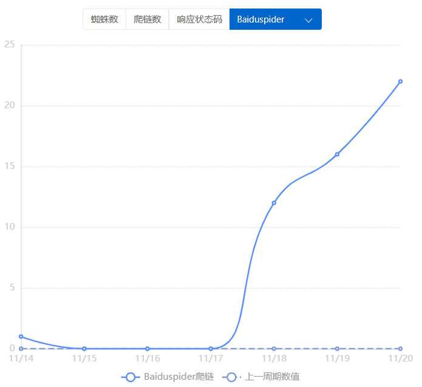
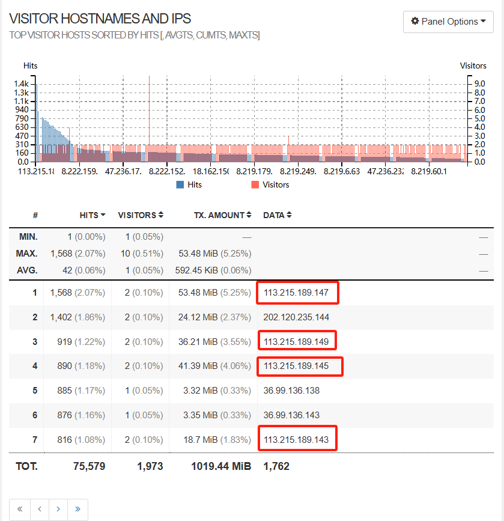

# 哋它亢 SEO优化技术

## 基于Nuxt的SEO友好Web开发

Vue 框架是现代Web开发中最为流行的框架之一。官网中对它的介绍如下：

> Vue (发音为 /vjuː/，类似 **view**) 是一款用于构建用户界面的 JavaScript 框架。它基于标准 HTML、CSS 和 JavaScript 构建，并提供了一套声明式的、组件化的编程模型，帮助你高效地开发用户界面。无论是简单还是复杂的界面，Vue 都可以胜任。

Vue 采用渐进性的开发模式，允许高效地开发单页面应用（SPA）。但与此同时，Vue 框架的一些特性也不利于 SEO 的优化：

- 路由：Vue 框架本身并未提供原生的简便路由，在开发上存在一定困难
- 客户端渲染（CSR）：服务端收到请求后返回基本的 HTML 文件， Javascript 以及 CSS 文件，由客户端执行 JS 代码获取数据进行渲染。同时在搜索引擎进行爬取时，需要进行渲染后抓取元素。虽然减轻了服务器压力，但也导致了客户端性能的减弱，以及搜索引擎爬取的困难

Nuxt.js 是基于 Vue.js 框架，在其基础上提供了开箱即用的服务端渲染（SSR）、静态应用构建、自动路由、SEO支持。

我们的主站便基于 Nuxt 框架，在开源模板 `content-wind` 的基础上进行 Web 开发，项目地址 [atinux/content-wind: A lightweight Nuxt theme to build a Markdown driven website. Powered by Nuxt Content, TailwindCSS and Iconify.](https://github.com/Atinux/content-wind)。

## 基于内容的SEO

在 SEO 策略中，需要针对搜索引擎爬虫对内容的检测进行特定的优化，我们关注内容的如下方面：

- tdk 优化：

  - 标题（title）：标题关乎着搜索引擎对网站主题等的判断，需要适当的长度，以及包含关键词，可采用“长尾关键词”等方式利用。
  - 描述（description）：描述是展示在搜索引擎展示的网站简介内容，同样需要能够包含关键词，长度也需要保持在特定范围
  - 关键词（keywords）：根据我们的研究，例如谷歌等现代搜索引擎已经不再关注关键词的建设，以防止关键词标签的滥用

- 文章优化：

  我们网站的的主要部分是文章展示，形成类似新闻网站与博客的效果。在文章内容上，我们有以下关注点：

  - 关键词的分布：需要将关键词均匀的分布在文章中，且在关键位置插入关键词（如正文的第一段）
  - 子标题：在子标题中需要适当插入关键词
  - 富文本内容：在文本中增加图片等内容，以增加文章丰富度

## 基于链接的SEO

在现代搜索引擎中，网站的内链以及外链是评估网站质量以及发掘网站的重要内容。为此，我们针对内外链进行了特定的优化。

为了增加导向主站的外链，我们利用 wordpress 建设了子站 wordpress.datacon-14351.xyz ，在子站中我们同样进行了 SEO 建设，并在其中插入了导向主站的外链。

与此同时，我们还利用第三方网站进行链接建设：

- CSDN：在比赛期间，本队伍发表了数十篇CSDN博客，是最早一批进行CSDN博客外链建设的队伍，且文章群共获得了近万的浏览量。
- 百度贴吧：作为百度的重要社交论坛，本站队员建立了“哋它亢吧”百度贴吧，并在其中发贴进行网站引流。截至比赛结束，本站队员保持着该贴吧活跃第一的位置。
- 查询外链建设：利用站长工具，本站将链接插入其他高权重站点中，由于插入工具采用“搜索框插入”的方式，合理的进行了外链建设

## 其他 SEO 优化

- 性能优化：
  - 开启 gzip 压缩，提高网站传输性能
  - 图片压缩：一律采用更适合 Web 应用的 webp 格式图片
  - 服务器端渲染：在服务器端对页面渲染完毕后传送给客户端
- 安全性优化：
  - 部署 SSL 证书，提高网站传输安全性
  - 对发布内容进行审查，避免不当内容

## SEO工具利用以及审计

在比赛过程中，本队利用了多种 SEO 以及站点工具帮助 SEO 优化：

- 百度站长工具：链接推送以及抓取检测
- 百度诊站：检测网站性能以及安全性
- search console：谷歌站点检测与推送
- oogle Analytics：站点用户数据分析
- wordpress插件：包括 Yoast SEO 以及 蜘蛛分析 等插件

在 SEO 优化中，若网站出现 404，5xx 等错误状态码，将影响网站的质量。因此，本站坚持使用 `goaccess` 工具对 nginx 日志进行分析

## 网站安全以及竞争对手分析

本网站架构采用 `nginx 1.20.1` + `Nuxt.j` + `wordpress` 自建立初便完善了网站的相关安全措施：

- 定期日志分析以及异常检测：采用 `goaccess` 对日志进行监测以及分析，识别不当访问，及时完善相应防护

  

  在某日日志中，我们发现了大量来自同一 IP 区段的访问，对其进行反向定位并审查。

- 访问权安全措施：我们对 wordpress 站点的后台入口进行了隐藏，并在网站关键位置避免了弱密码。

在 SEO 优化中，针对特定关键词或者产品的竞争对手的分析也十分重要。在比赛初期，本队便完成了对所有队伍的域名以及网站的发掘以及整理，收集了各网站建站初期暴露的信息资产。在后续过程中，本队便基于这些信息进行了竞争 SEO 的审查。